# Airflow Spark ETL Pipeline

## Table of Contents

- [Introduction](#introduction)
- [Data](#data)
- [Project Structure](#project-structure)
- [Set Up](#set-up)
- [Usage](#usage)
- [Conclusion](#conclusion)

## Introduction
This project focuses on building automated data pipelines using **Apache Airflow** to streamline the flow of data across various stages. The **Airflow DAG** consists of four key tasks that facilitate the extraction, transformation, and loading (ETL) of data:

1. Extract data from **MySQL**, serving as the primary data source.
2. Convert the extracted data into Parquet format and store it in **Amazon S3**, designated as the raw zone for unprocessed data.
3. Utilize **Apache Spark** to process the raw data from **S3** and store the transformed data in another **S3** bucket, referred to as the golden zone, where the refined data resides.
4. Read the processed data using **Spark** and load it into a **PostgreSQL** database for further analysis and reporting.

## Data
I use a **Python** script to generate synthetic data for three tables in a **MySQL** database: customers, products, and orders. To ensure portability and ease of deployment, a **Dockerfile** is created to encapsulate the **Python** application within a container. This container can seamlessly run within a **Docker Compose** network, allowing for smooth communication with the MySQL database service.

**Schema**
    <br/>
    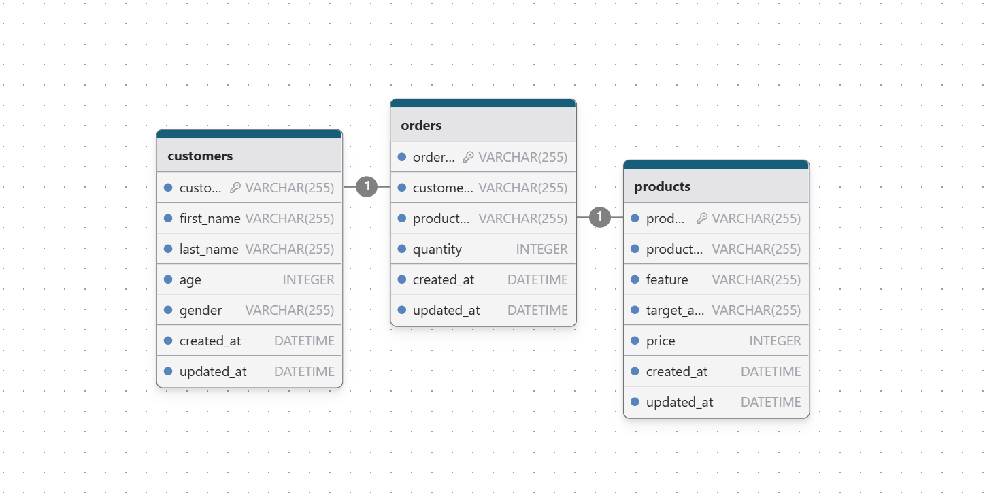

I use spark to process this data. I created 2 tables: the total amount collected from each customer and the total amount collected from each product. These two tables are named customer_revenue and product_revenue. It helps evaluate purchasing needs and devise business strategies.


## Project Structure
```power shell
├── Dockerfile
├── README.md
├── dags
│   ├── etl.py
│   └── tasks
│       ├── extract.py
│       ├── load_aws.py
│       ├── load_db.py
│       └── transform.py
├── databases
│   ├── mysql
│   │   └── initdb
│   │       └── init.sql
│   └── postgres
│       ├── initdb
│       │   └── init.sql
│       └── jdbc
│           └── postgresql-42.7.4.jar
├── docker-compose.yaml
├── generators
│   ├── Dockerfile
│   ├── main.py
│   └── requirements.txt
└── requirements.txt
```

## Set Up
1. Install **Docker** and **Docker Compose**.
2. **AWS** set up:
- In the **IAM** dashboard, click on **Users** from the sidebar. Create user and set S3 permission for this user. Then, get **AWS Access Key** ID and **AWS Secret Access Key**. 
    <br/>
    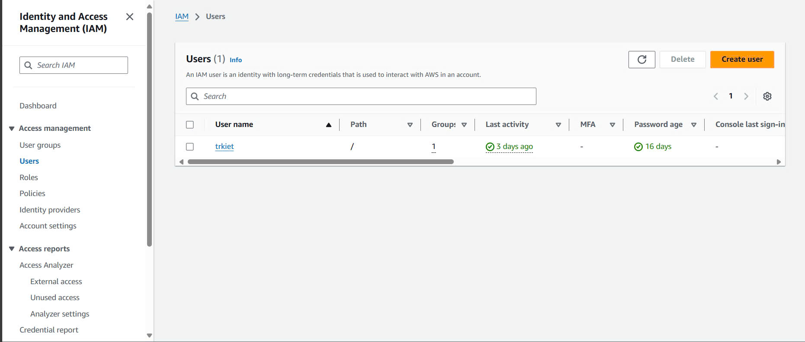
- Create **Raw zone bucket** and **Golden zone bucket** in **AWS S3 Storage**.
    <br/>
    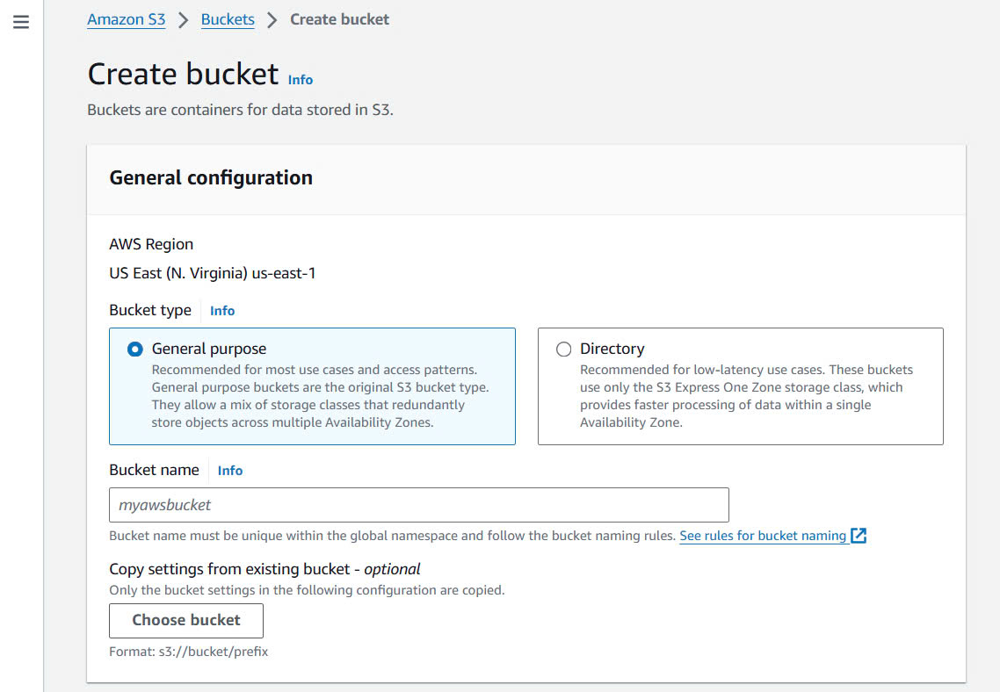
3. **Telegram** set up:
- Open **Telegram** and search for **BotFather**. Start a chat with **BotFather** by typing /start. Use the command /newbot to create a new bot. After create a new bot, it will give you **Bot API Token**.
    <br/>
    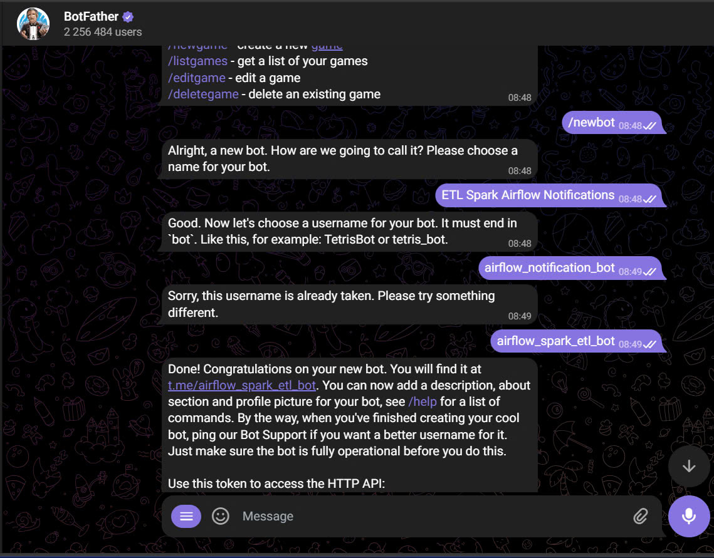
- Search for **userinforobot**. Start a chat with **userinforobot** by typing /start. It will give you **Chat ID**.
4. Clone this repository and navigate to the project directory.
5. Create your .env file and fill in according to .env.example.
6. Build and start the Docker containers:
```power shell
docker-compose up -d
```

## Usage
1. Once the containers are up and running, access the Airflow webserver at http://localhost:8080.
2. Login with your credentials.
3. In Navbar, click Admin > Connection. Then, create new connection. In this project, you must create 4 connection: AWS, Spark, MySQL, and Postgre. Please fill in according to my instructions. If that connection requires credentials, you need to fill in that information according to your .env file. For information that I don't fill in, you don't need it either.
- Create AWS connection:
    <br/>
    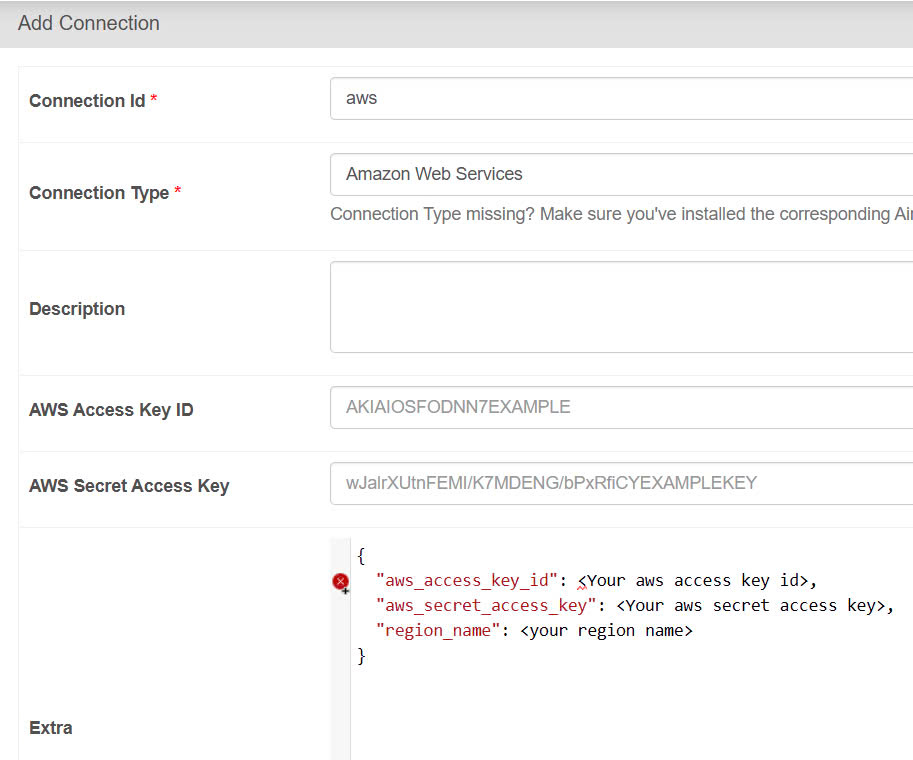
- Create MySQL connection:
    <br/>
    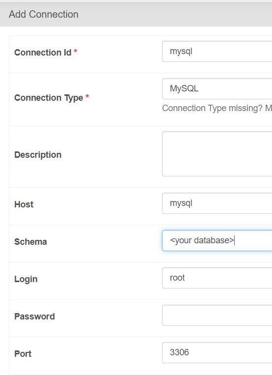
- Create Postgres connection:
    <br/>
    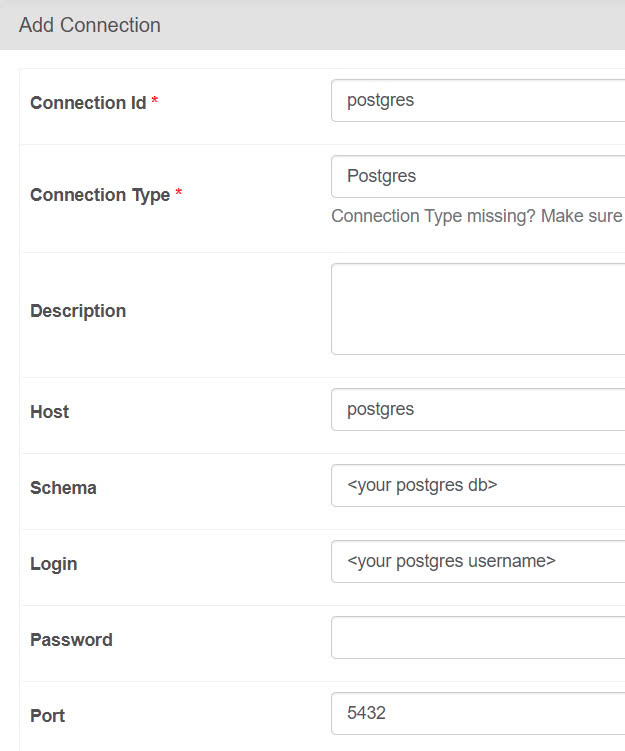
- Create Spark connection:
    <br/>
    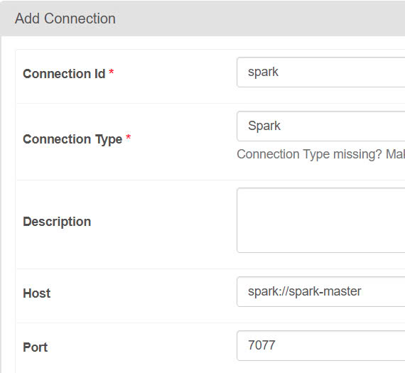
4. Run this dag and see the results. After a task is finished running, your telegram bot will notify you of the status of that task (success/fail). You can go to postgreSQL and check whether the data has been loaded or not
    <br/>
    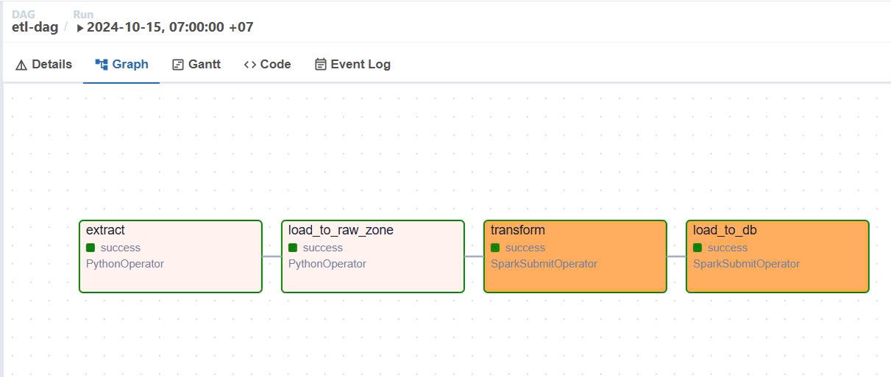
    <br/> <br/>
    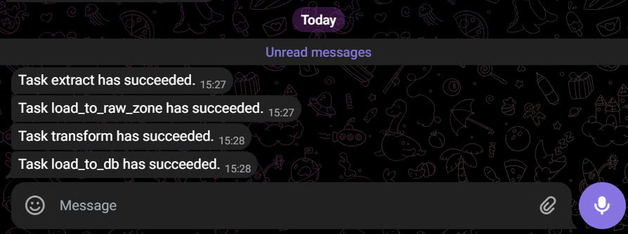
    <br/> <br/>
    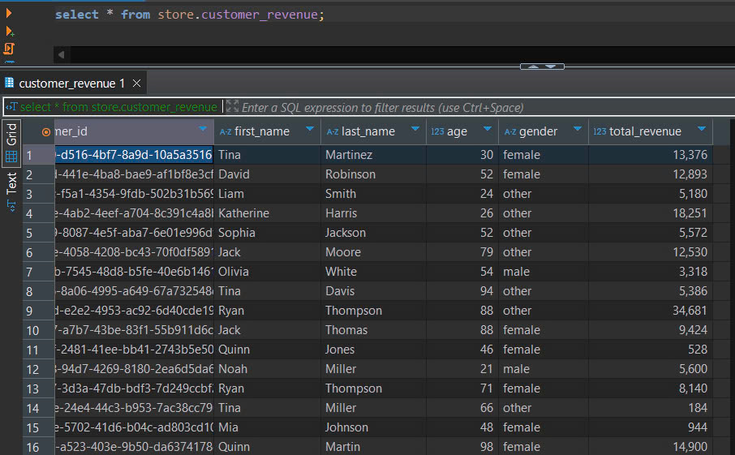

## Conclusion
This is my first time doing a project related to Apache Airflow. I spent some time learning how to use it and also created a simple project. <br/>
Thank you for viewing my project.